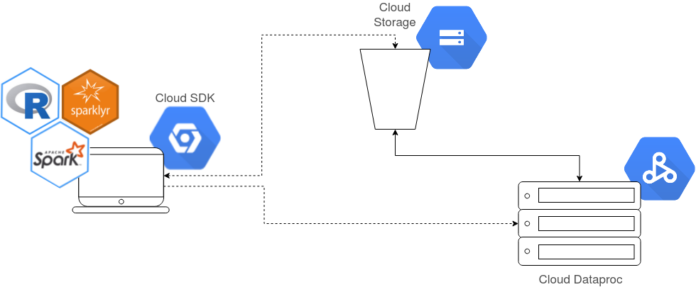
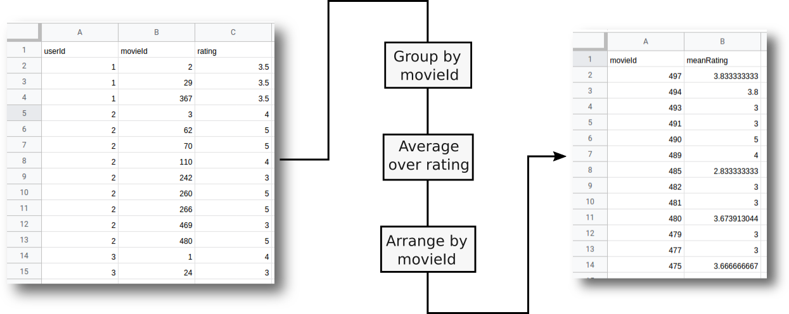
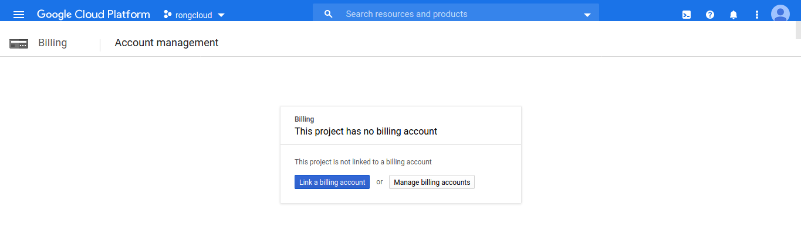
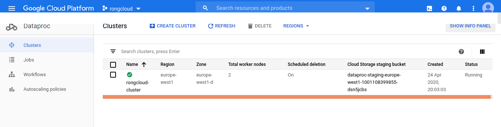
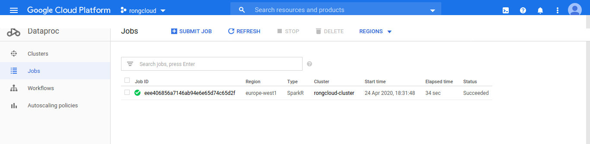
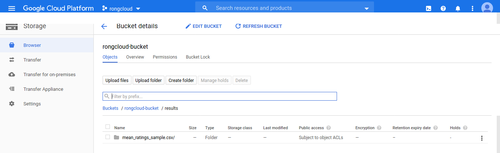

# R on Gcloud



This little project is aimed at those looking to start learning how to run R
workloads at scale on cloud servers. Specifically, the stack we utilize
in this example can be summarized as:

    R  + sparklyr + Apache Spark + Gcloud Dataproc + Gcloud Storage  

[Google Dataproc](https://cloud.google.com/dataproc/) is
Google's managed offering for `Hadoop` and `Spark` distributed computation at
scale.

The example `R` source code here provided reads `.csv` data containing movies
and user ratings, computes the average ratings for each movie, sorts them up,
and exports the result to a new file.



**IMPORTANT**: `R` source code works both locally and on the cloud.

The project includes also a series of `bash` scripts that automate the
setup and deployment of jobs to the Gcloud servers. Scrips are full of comments
that will hopefully guide you if you would like to know what exactly are the
necessary steps for the stack to operate.

I highly recommend watching [Nathan Stephens's talk in Spark Summit](https://www.youtube.com/watch?v=oItFZfzqqMY)
to get a the big picture of what  `SparkR` and `sparklyr` libraries have to
offer. Make sure to also checkout [this Google Cloud Labs video](https://www.youtube.com/watch?v=h1LvACJWjKc&feature=emb_logo)
to start off with Gcloud Dataproc.

All `R` and `bash` scrips were developed/tested on:
* `Debian 9` and `Ubuntu  16.04`
* `R 3.3` and `3.4`
* `Spark 2.3` and `2.4`
* `sparklyr 1.2`
* `Gcloud SDK 289.0`

## Dataset

The data (~300 MB) can be download from [Gdrive](https://drive.google.com/drive/folders/14Y1rSDP0GG4GFy5gI6bbmTKI1gqnEUaK?usp=sharing).
Make sure  to download the `.csv` files into the `data/` directory.

## Prerequirements

### 1. Register in Google Cloud Platform

Register a new email (doesn't need to be gmail) in [Google Cloud Platform](https://console.cloud.google.com)
to gain $300 worth of credit. Note that even though Gcloud grants credits at
start, you will be asked to provide billing information before being able to
make use of Gcloud services.

### 2. Install Gcloud command-line tools

To access gcloud commands in your local terminal, install Google Cloud SDK by
following the [official instructions](https://cloud.google.com/sdk/docs).
Make sure you run `gcloud init` at the  end of the installation process
so that your machine gets authorized to manage your Gcloud account.

## Setup

### 0. Install the required R libraries

The following command takes care for installing the user-specified libs:
```bash
./0_install_r_libs.sh
```
**NOTE**: If later on the projects depends on new libraries, make sure to
add them to `0_install_r_libs.sh` as this file will also be used to install
libraries on the remote Gcloud server (`Spark` server).

### 1. Create a new Gcloud project

To start working, it is necessary  to create a Gcloud project. This action
only executed once (the provided `bash` script verifies if the project exist
before trying to create it). Once a project is created, we can deploy a server:

```bash
./1_create_gcloud_project.sh
```

**IMPORTANT**: Make sure to login to [Gcloud Console](https://console.cloud.google.com),
navigate to the "Billing" panel and link the newly created project to the
billing account that you created in step 1 of the [Pre-requirements](#prerequirements)
section:



### 2. Create a Gcloud Storage bucket and upload the dataset

Create some storage for the dataset and project-related files:
```bash
./2_create_gcloud_storage.sh
```

### 3. Deploy a Gcloud Server (Spark Server)

Start the server:
```bash
./3_deploy_gcloud_server.sh
```

**IMPORTANT**: If idle for 1 hour, the server will automatically shutdown.
Run the above command again to re-deploy the server. The amount of idle time
before shutdown is defined by `SHUTDOWN_AFTER` in `./0_set_gcloud_env.sh`.



## Submitting Jobs to Gcloud

The provided `bash` script will upload the content
of the `src/` directory to Gcloud Storage and requests the server (`Spark`
server) to execute it:

```bash
./4_submit_gcloud_job.sh
```

**IMPORTANT**: Before submitting the job, make sure to set `DISTRIBUTED`
to `TRUE` in `config.R`. This is required to star R on the `Spark` environment
and to fetch the dataset from the cloud storage.

The terminal should display the status of the job as well as the print
statements of the `R` code. If for example we process `raitings_sample.csv` we
obtain:

```bash
Building synchronization state...
Copying file://src/main.R [Content-Type=application/octet-stream]...
/ [1/1 files][  1.9 KiB/  1.9 KiB] 100% Done
Operation completed over 1 objects/1.9 KiB.
Job [eee406856a7146ab94e6e65d74c65d2f] submitted.
Waiting for job output...

[1] "INFO - Loading data..."

[1] "INFO - Processing data..."
[1] "DEBUG - df of mean ratings:"
# Source: spark<?> [?? x 2]
  movieId meanRating
    <int>      <dbl>
1      50       4.42
2      70       3.33
3     110       4.19
4     440       3.94
5     457       4.32
6     350       3.86
[1] "DEBUG - df sorted by mean rating:"
# Source:     spark<?> [?? x 2]
# Ordered by: desc(meanRating)
  movieId meanRating
    <int>      <dbl>
1      18          5
2     213          5
3     249          5
4     239          5
5      86          5
6     471          5
[1] "DEBUG - df sorted by id:"

# Source:     spark<?> [?? x 2]
# Ordered by: desc(meanRating), desc(movieId)
  movieId meanRating
    <int>      <dbl>
1     497       3.83
2     494       3.8
3     493       3
4     491       3
5     490       5
6     489       4
[1] "INFO - Exporting data..."
[1] "INFO - All done in 17.146 s"
Job [eee406856a7146ab94e6e65d74c65d2f] finished successfully.
```

On Gcloud the [Gcloud Console](https://console.cloud.google.com), you will see the submitted job under the `Dataproc -> Jobs ` section:



The resulting file of the execution will be located in the Gcloud Storage bucket we created previously:



To copy the results to your local machine you can run the command below, making
sure to replace  `BUCKET_NAME` for the correct name:

```bash
# gsutil -m rsync -r gs://BUCKET_NAME/results results
gsutil -m rsync -r gs://rongloud-bucket/results results
```
## Development

All the  R code necessary for the execution is expected to be under the  
`src/` directory. The `main.R` file is the entry point of the execution, and it
imports functions from the remaining files:

* `env.R`: Offers functions to define environment settings needed during
runtime.
* `io.R`: Hold all functions needed to load data either from
localhost or a remote location.
* `subroutines.R`: Contains all subroutines of heavy computation (data
wrangling, data sorting, aggregating, modeling, ...)
* `config.R`: Contains definitions for things like the paths to input/output
files, whether or not to executed the code on distributed mode, and whether
or not to print debug messages.

**NOTE**: Feel free to add more definitions to `config.R` if needed.


## Testing

The project also includes an example unittest for fucntions in `subroutines.R`.
To verify that all unittest defined under the `scr/tests/` directory are passing,
you can run:

```bash
./0_run_uittests.sh
```

If all unittest pass, you will get and OK report:
```r
✔ |  OK F W S | Context
✔ |   3       | test_subroutines [0.2 s]

══ Results ═════════════════════════════════════════════════════════════════════
Duration: 1.4 s

OK:       3
Failed:   0
Warnings: 0
Skipped:  0
```

**NOTE**: Although ideally every function should have a corresponding
unittest, perhaps its ideal to star by focusing on the subroutines.
If you add a new function `subroutines.R`, you can add its corresponding
test to `test_subroutines.R` and run the above command to obtains
the results.

## Useful Resources

* `SparkR` [manual](https://rdrr.io/cran/SparkR/man/) and [code examples](https://github.com/apache/spark/tree/master/examples/src/main/r).
* `sparklyr` on Rstudio [documentation](https://spark.rstudio.com/).
* [Unittesting in R](https://towardsdatascience.com/unit-testing-in-r-68ab9cc8d211).

## TODO

1. Add `Cloud SQL` as source/destination of data and modidy the `R` code create
Dataframes out of queries []
2. Add cluster configurations when creating a `Spark` session in `R` to ensure
high performance on the server side! [X]
3. Add diagram of how this looks stack looks/operates [X]
4. Add `bash` script to clean up Gcloud after the project on user command []
